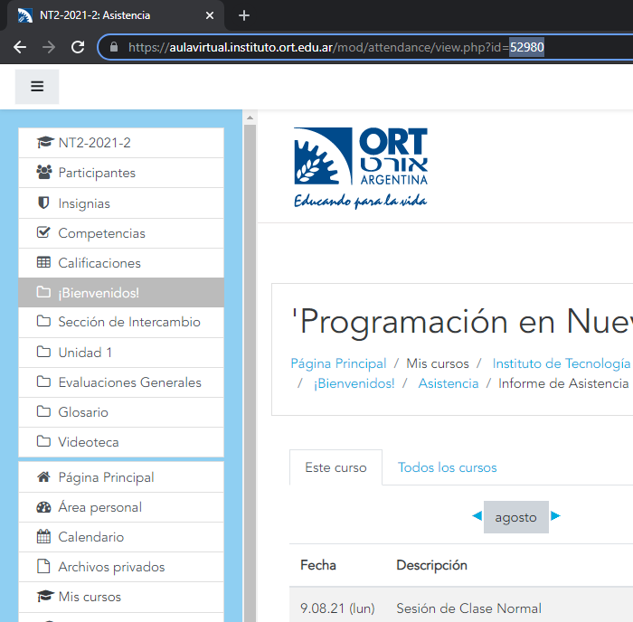

# Bot de selenium para dar presente en ORT.

## Requisitos
- [Node.js](https://nodejs.org/)
- El Browser Driver de [Selenium](https://www.selenium.dev/) para el navegador que uses. [Instrucciones para instalar](https://www.selenium.dev/documentation/getting_started/installing_browser_drivers/)

## Instalación
Pararse en la carpeta y ejecutar `npm install`.

## Configuración
Crear un archivo `.env` desde el archivo de plantilla `.env.example` agregando el usuario de ORT (normalmente el DNI) en el campo `ORT_USERNAME` y la contraseña en el campo `ORT_PASSWORD`. Tranqui, nadie te la va a robar, el archivo es local :)

Agregar en el archivo `presente.js` en la constante `materias` una línea con el código de la materia en minúscula y el [ID de presentismo](#user-content-obtener-el-id-de-presentismo-de-una-materia) adelante entre comillas simples. Por ejemplo:
```js
const materias = {
    // ...
    nt2: '52980',
    // ...
};
```

## Funcionamiento
Pararse en la carpeta y ejecutar `node presente <materia>` reemplazando la `materia` por el código de la materia en minúscula (ejemplo: `nt2`).

## Obtener el ID de presentismo de una materia
Ir a la página de asistencia de la materia en cuestión, y mirar el campo `id` del URL. Por ejemplo, entrando al presentismo de NT2, se puede ver el id 52980.
